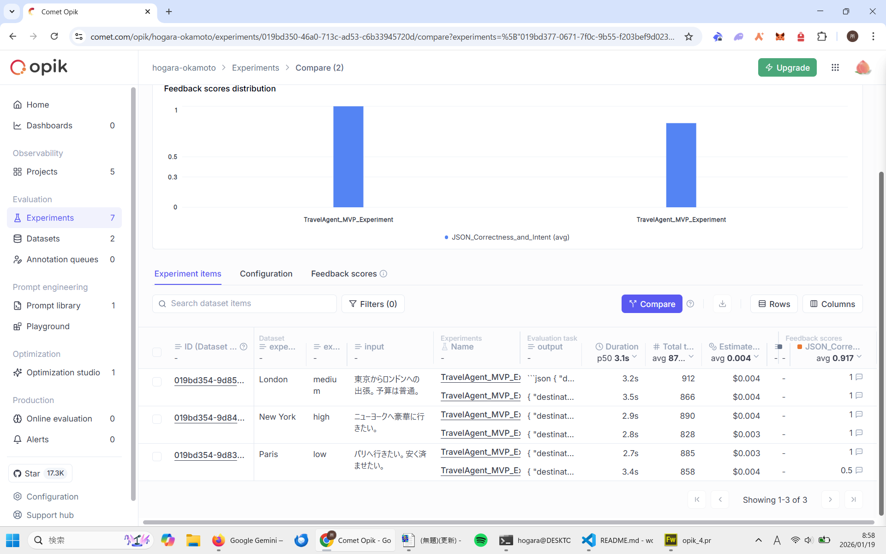

# ✈️ World Travel Agent MVP (Powered by LangGraph & Opik)

A minimalist World Travel Agent that generates structured itineraries (JSON) using **LangGraph** for orchestration and **Opik** for evaluation and observability.

Built for the **"Best Use of Opik"** Hackathon category.

## 🚀 The "Opik Effect": From 83% to 100% Accuracy
The core value of this project is not just the agent, but the **evaluation loop**. I used Opik's **Compare** feature to visualize the improvement.

### The Problem & The Solution
1.  **Before (Blue):** Score **0.83**. The agent returned Japanese text ("パリ") instead of the expected English ("Paris"), causing a failure.
2.  **After (Orange):** Score **1.0**. After updating the system prompt to enforce English output, the agent passed all test cases perfectly.

### 📊 Evidence (Opik Comparison View)


## 🛠 Tech Stack
- **LangGraph:** For stateful agent orchestration.
- **Opik:** For tracing, observability, and evaluation datasets.
- **OpenAI (GPT-4o):** LLM backbone.
- **Pydantic:** For strict data validation.

## 📂 Project Structure
```bash
.
├── main.py       # Agent logic with LangGraph & Opik Tracing
├── tools.py      # Mock travel tools (Flights/Hotels)
├── evaluate.py   # Opik Evaluation Script (The Judge)
└── dataset.json  # Test cases for Paris, NY, and London

## How to Run

### Clone & Install
    git clone git@github.com:hogara-okamoto/world-travel-agent.git
    pip install -r requirements.txt

### Setup Environment Create a .env file:
    OPENAI_API_KEY=sk-...
    OPIK_API_KEY=...

### Run the Agent
    python main.py

### Run Evaluation (The Magic)
    python evaluate.py