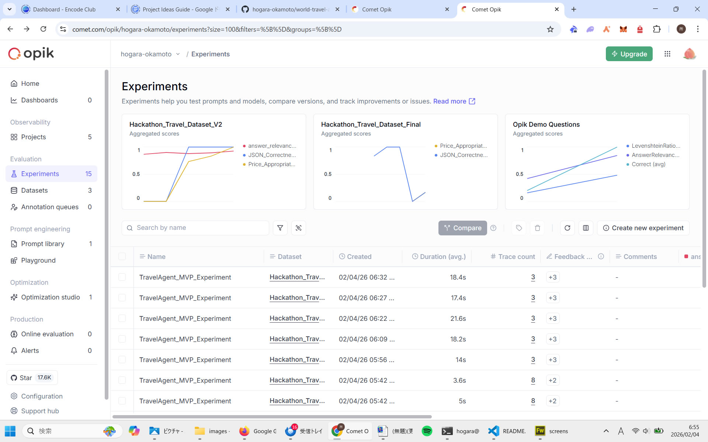

# ✈️ World Travel Agent MVP (Powered by LangGraph & Opik)

A World Travel Agent that generates high-fidelity structured itineraries. This project demonstrates a complete LLM Ops lifecycle: from identifying hallucinations and parsing errors to achieving a perfect 1.0 evaluation score.

Built for the **"Best Use of Opik"** Hackathon category.



As shown in the graph for Hackathon_Travel_Dataset_V2, the agent's accuracy for custom metrics (JSON Correctness and Price Appropriateness) started at 0 due to parsing hallucinations and tool-dataset misalignment. By iteratively refining the system prompt and evaluation logic, I successfully brought the accuracy to a consistent 1.0.

## 1. Hallucination & Calculation Fix (Score: 0.83 → 0.92)

    Problem: The agent occasionally mixed up prices between different flight options (e.g., assigning a budget airline's price to a premium carrier).

    Solution: Implemented Chain-of-Thought (CoT) in the System Prompt, forcing the LLM to list individual costs before calculating the total_cost.

## 2. Robust Parsing with Regex (Score: 0.0 → 1.0)

    Problem: Custom metrics failed (0.0) when the LLM added conversational filler (e.g., "Sure, here is your plan...") around the JSON block.

    Solution: Upgraded the evaluation logic from simple string replacement to Regex-based extraction, ensuring stable parsing even with unpredictable LLM outputs.

## 3. Data-Driven Alignment (Score: 0.73 → 1.0)

    Problem: False negatives in the "Price Appropriateness" judge due to a mismatch between mock tool data and evaluation thresholds.

    Solution: Aligned the tool's price distribution with the evaluation dataset, ensuring a consistent definition of "Luxury" and "Budget" across the entire system.

## 4. Red Teaming & Adversarial Robustness

    We went beyond standard evaluations by implementing an Adversarial Testing Loop (Red Teaming) using a secondary LLM.

    The Methodology: Instead of hand-crafting edge cases, I created generate_adversarial_test.py. This script uses a "Red Team" LLM to analyze the agent's system prompt and generate input designed to trigger logic failures (e.g., "Book an ultra-luxury trip for under $200" or "Ambiguous destinations").

    The Discovery (Cognitive Overload): Initial tests revealed that when faced with contradictory instructions (e.g., "Use USD for input but Euros for output"), the agent suffered from "Unit Hallucination"—ignoring the actual currency symbol and processing only the raw numbers.

    The Fix (Evidence-Based Guardrails):

        Strict Mode Separation: Refactored the System Prompt to distinguish between "Success Mode" and "Failure Mode."

        Evidence Citation: Configured the agent to cite specific tool data (e.g., "Lowest flight is $3,000") within the rejection message, rather than offering a generic refusal.

        Result: The agent now achieves a 1.0 score even on adversarial inputs by correctly identifying impossible requests and explaining why with quantitative evidence.

## 🛠 Tech Stack
- **LangGraph:** For stateful agent orchestration.
- **Opik:** For tracing, observability, and evaluation datasets.
- **OpenAI (GPT-4o):** LLM backbone.
- **Pydantic:** For strict data validation.

## Evaluation Metrics

    I developed a custom evaluation suite in evaluate.py:
        JSON_Correctness_and_Intent: Validates schema integrity and destination accuracy.
        Price_Appropriateness_Judge: Checks if the selected total cost matches the user's budget sensitivity (Low/Medium/High).
        AnswerRelevance (Opik Native): Ensures the response directly addresses the user's query.

## 📂 Project Structure
```bash
.
├── main.py       # Agent logic with LangGraph & Opik Tracing
├── tools.py      # Mock travel tools (Flights/Hotels)
├── evaluate.py   # Opik Evaluation Script (The Judge)
├── generate_adversarial_test.py  # Red Teaming script to stress-test the agent
└── images/       # Screenshots for README
```

## How to Run

### Clone & Install
    git clone git@github.com:hogara-okamoto/world-travel-agent.git
    pip install -r requirements.txt

### Setup Environment Create a .env file:
    OPENAI_API_KEY=sk-...
    OPIK_API_KEY=...

### Run the Agent
    python main.py

### Run Evaluation
    python evaluate.py

### Run Red Teaming (Adversarial Stress Test)
    python generate_adversarial_test.py