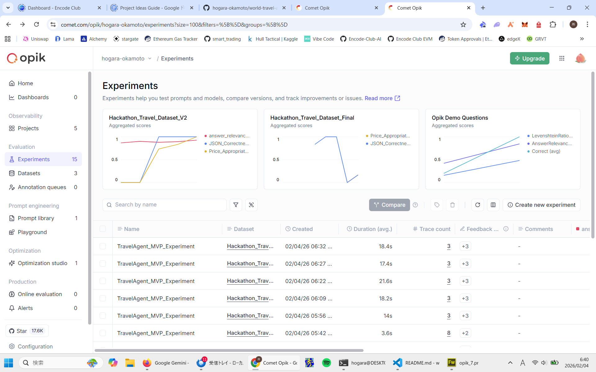

# ✈️ World Travel Agent MVP (Powered by LangGraph & Opik)

A professional Travel Agent agent that generates high-fidelity structured itineraries. This project demonstrates a complete LLM Ops lifecycle: from identifying hallucinations and parsing errors to achieving a perfect 1.0 evaluation score.

Built for the **"Best Use of Opik"** Hackathon category.



As shown in the graph for Hackathon_Travel_Dataset_V2, the agent's accuracy for custom metrics (JSON Correctness and Price Appropriateness) started at 0 due to parsing hallucinations and tool-dataset misalignment. By iteratively refining the system prompt and evaluation logic, I successfully brought the accuracy to a consistent 1.0.

## 1. Hallucination & Calculation Fix (Score: 0.83 → 0.92)

    Problem: The agent occasionally mixed up prices between different flight options (e.g., assigning a budget airline's price to a premium carrier).

    Solution: Implemented Chain-of-Thought (CoT) in the System Prompt, forcing the LLM to list individual costs before calculating the total_cost.

## 2. Robust Parsing with Regex (Score: 0.0 → 1.0)

    Problem: Custom metrics failed (0.0) when the LLM added conversational filler (e.g., "Sure, here is your plan...") around the JSON block.

    Solution: Upgraded the evaluation logic from simple string replacement to Regex-based extraction, ensuring stable parsing even with unpredictable LLM outputs.

## 3. Data-Driven Alignment (Score: 0.73 → 1.0)

    Problem: False negatives in the "Price Appropriateness" judge due to a mismatch between mock tool data and evaluation thresholds.

    Solution: Aligned the tool's price distribution with the evaluation dataset, ensuring a consistent definition of "Luxury" and "Budget" across the entire system.

## 🛠 Tech Stack
- **LangGraph:** For stateful agent orchestration.
- **Opik:** For tracing, observability, and evaluation datasets.
- **OpenAI (GPT-4o):** LLM backbone.
- **Pydantic:** For strict data validation.

## Evaluation Metrics

    I developed a custom evaluation suite in evaluate.py:<br>
        JSON_Correctness_and_Intent: Validates schema integrity and destination accuracy.<br>
        Price_Appropriateness_Judge: Checks if the selected total cost matches the user's budget sensitivity (Low/Medium/High).<br>
        AnswerRelevance (Opik Native): Ensures the response directly addresses the user's query.

## 📂 Project Structure
```bash
.
├── main.py       # Agent logic with LangGraph & Opik Tracing
├── tools.py      # Mock travel tools (Flights/Hotels)
├── evaluate.py   # Opik Evaluation Script (The Judge)
└── images/       # Screenshots for README
```

## How to Run

### Clone & Install
    git clone git@github.com:hogara-okamoto/world-travel-agent.git
    pip install -r requirements.txt

### Setup Environment Create a .env file:
    OPENAI_API_KEY=sk-...
    OPIK_API_KEY=...

### Run the Agent
    python main.py

### Run Evaluation (The Magic)
    python evaluate.py